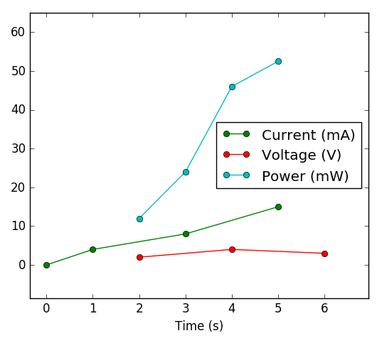

[BACK TO HOME PAGE](MainPage.html)

# Arrays module 

## Description 

A typical problem for engineers or physicists is to manipulate functions defined by sampled data. DataArrays can be added, multiplied, etc. even if their samplings are not identical, by means of linear interpolations.

## Syntax 

A DataArray can be build with the following syntax :
```python
data = DataArray(X,Y)
```

with X and Y two 1D numpy arrays (or Quantity objects which value are numpy arrays, if using units module) with the same shape. The only useful method (beyond the constructor) is 'without_units':

```python
data.without_units(unit_x=None,unit_y=None)
```

This will return a 2-column numpy array, the first column being X and the second column Y, but without their unit (if they have one). If no unit is specified, X and Y values will be the SI values. If unit_x or unit_y is specified, X or Y is divided by the specified unit instead of SI unit.

## Example of use 

Considere the following example:

We want to measure dissipated power in an electrical component. We have two different sensors:
 * one sensor gives the value of the electric current versus time
 * one sensor gives the value of the voltage versus time

To calculate the power, we just have to multiply the electric current by the voltage. However these are given by two independant sensors, which time sampling might not be the same.

```python
from units import *
import numpy as np
# Data for current
I_time =   np.array([0,1,3,5])*s
I_values = np.array([0,4,8,15])*mA

# Data for voltage
V_time =   np.array([2,4,6])*s
V_values = np.array([2,4,3])*V
```

The Arrays module is able to multiply those two sets of data, by linearly interpolating the data in order to build a common time sampling.


```python
from arrays import DataArray
I_data = DataArray(I_time, I_values)
V_data = DataArray(V_time, V_values)
P_data = I_data*V_data

P_data
```

will return:

```
DataArray with units : s | kg*m**2/s**3
[[ 2.     0.012]
 [ 3.     0.024]
 [ 4.     0.046]
 [ 5.     0.052]]
```

The first column is time, the second column is power. The units of each column are displayed at the top of the array.

The new time sampling contains only samples for which both current and voltage were defined (no extrapolation). The sample step is the smallest of the two samplings, so that well-sampled input data result in well-sampled output data.

A graphical representation of what happened is the following:



This image has been generated using [Graph](Graph.html) module and the following code:
```python
import graph
mW = 0.001*W
C_I = graph.Curve(I_data.without_units(s,mA), marker = '-o', label = 'Current (mA)')
C_V = graph.Curve(V_data.without_units(s,V), marker = '-o', label = 'Voltage (V)')
C_P = graph.Curve(P_data.without_units(s,mW), marker = '-o', label = 'Power (mW)')
G = graph.Graph([C_I, C_V, C_P], xlabel = 'Time (s)')
```

## Use as continuous functions

It is also possible to use DataArrays as if they were continuous functions, as in the example below.

```python
P_data(4.5*s)
```

will return:
```
0.049  kg*m**2/s**3 [PHYS]
```

DataArrays can be integrated (with the trapezoidal rule) with the following method:
```python
P_data.integ(2.5*s, 4.5*s)
```

will return:
```
0.069  kg*m**2/s**2 [PHYS]
```


[BACK TO HOME PAGE](MainPage.html)
