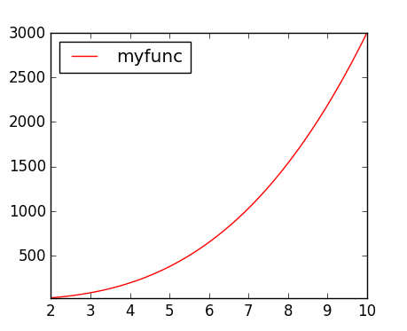
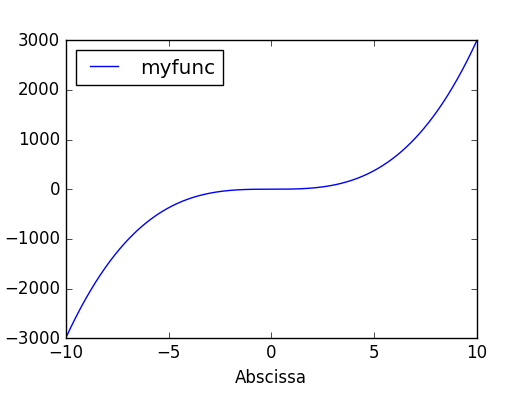
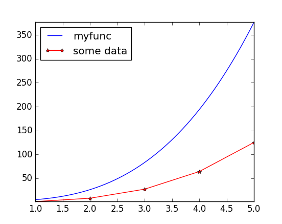
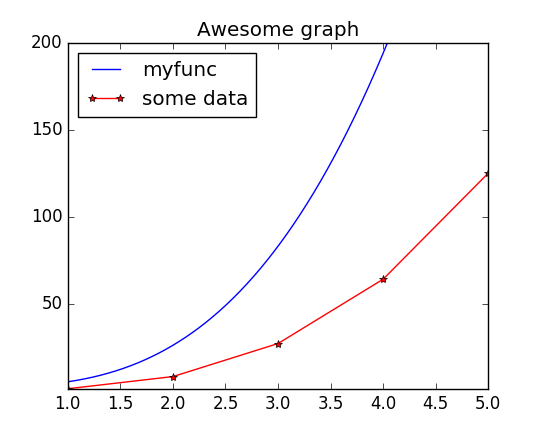

[BACK TO HOME PAGE](MainPage.html)

# Graph module 

## Description 

This module is a front-end to matplotlib. Matplotlib built-in front-end is very powerful but lacks the following features:
 * a way to plot the same data (with the same colors and the same labels) on several graphs, without having to duplicate code
 * the ability to plot a function without having to sample it
 * automatic labelling (when plotting function 'cos', one can expect the plot label to be 'cos'...)

Moreover, this module provides a simple object-oriented API to edit the graphs and curves.


## Syntax 

This module defines the following objects:
 * a Curve object, which is a function or data associated with formatting options and a label (this is not yet a plot)
 * a Graph object, which can plot several curves

### Curve objects 

To create a curve object, use the following syntax:

```python
curve = Curve(data, color = 'auto', marker='auto', label='auto')
```

The 'data' argument can be either:
 * a function: f
 * a tuple of two 1D-numpy arrays: (X,Y)
 * a 2D-numpy arrays with two columns

The 'color' argument can be any color string understood by matplotlib. Possible colors include:
 * 'g': green
 * 'r': red
 * 'c': 
 * 'm':
 * 'k':
 * 'b':

The 'marker' agument can be any marker string understood by matplotlib. Possible markers include:
 * '-': a line
 * '\*': a * symbol
 * 'o': a o symbol
Like in matplotlib, those markers can be combined (for instance '-o' will draw circles at the data points and join them with a line.

### Graph objects 

To build a Graph object, the syntax is the following:
```python
graph = Graph(list_of_curves, xmin = 'auto', xmax = 'auto', ymin = 'auto', ymax= 'auto', xlabel = '', ylabel = '', title = '', nb_pts = 1000):
```
with the following arguments:
 * list_of_curves is a python list of Curve objects
 * xmin, xmax, ymin and ymax are the extrama values of the plot area
 * xlabel and ylabel are the abscissa and ordinate labels
 * title is the title of the graph
 * nb_pts is the number of points used to sample functions (between xmin and xmax)

A Graph object will not be displayed unless you ask for it. This is done with the 'show' method:
```python
graph.show()
```


## Examples 

### Quick plot 

Quickly plotting a function (without having to build sampled data):
```python
from graph import *
def myfunc(x): return 3*x**3+2

quickGraph(myfunc,2,10) # show plot of f between xmin = 2 and xmax = 10
```

This will display the following image. Notice the automatic label.



This function also works with DataArrays defined in module [Arrays](Arrays.html), using the following syntax:

```python
quickGraph(my_data_array) 
```

Units of my_data_array will be displayed on the labels of the graph.


### Re-using a curve in several graphs 

We have a function and a set of data. We want to build two graphs :
 * the first one with just the function
 * the second one with the function and the data

```python
def myfunc(x): return 3*x**3+2

curve_1 = Curve(myfunc, color = 'b')

graph_1 = Graph([curve_1], xlabel = "Abscissa")
graph_1.show()

X = np.array([1,2,3,4,5])
Y = X**3
curve_2 = Curve((X,Y), marker = '-*', color='r', label = "some data")

graph_2 = Graph([curve_1, curve_2])
graph_2.show()

```

This code will display the following graphs:





### Object-oriented API 

When a graph has been built, it is easy to modify one single item of the graph and display it again. For instance, if we want to modify the last graph by adding a title and changing the y-scale:

```python
graph_2.ymax = 200
graph_2.title = "Awesome graph"
graph_2.show()
```

This results in the following graph:




[BACK TO HOME PAGE](MainPage.html)
