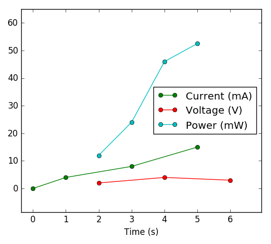

# pysics 

## What is it ? 

pysics is a set of python tools that might be useful for engineers or physicists.
It is composed of several python modules:

 * [Units](Units.html): a basic implementation of physical units (with numpy support)
 * [Graph](Graph.html): a matplotlib interface for easier data and function plotting
 * [Arrays](Arrays.html): a convenient way to handle sampled 1D-functions (with units)
 * [Physics](Physics.html): physical constants and some basic physics equations (a bit light for now...)


## How do I install it ? 

You don't install it for now, you just download and put the .py files where you want to use them.

You will also need the following packages:
 * python 3
 * numpy
 * sympy
 * scipy
 * matplotlib (for graph.py only)


## How do I use it 

Here are a few examples of how you could use pysics. These are just very short examples to give a rough idea of what each module does. More detailed examples are given in the wiki page of each sub-module.

### Units 

The following code:
```python
from units import *
speed = 36*km/hr
mass = 3*kg
Ec = 1/2 * mass * speed**2
print("Ec =", Ec )
print("Ec =", Ec/J, 'J' )
```
will return :

```python
Ec = 150.000  kg*m**2/s**2 [PHYS]
Ec = 150.0 J
```

pysics.units will also detect any dimension error. The module can work with numpy arrays.

For more examples, see [Units](Units.html) dedicated page.

### Graph 
```python
from graph import *
def myfunc(x): return 3*x**3+2
G = quickGraph(myfunc,2,10) # show plot of f between xmin = 2 and xmax = 10
```

This will display:

{{quick_graph.png}}

A graph can be easily edited:

```python
G.title = "Awesome graph"
G.ylabel = "My ordinates"
G.ymax = 5000
G.show()
```

will display:


For more examples, see [Graph](Graph.html) dedicated page.

### Arrays 

One of the feature of Arrays module is to multiply (or any other operation) data sets with different samplings. The following graph is a visual representation of what Arrays can do: Power is the product of Current by Voltage.



For more details on how to use the Arrays module, see the [Arrays](Arrays.html) dedicated wiki page.

### Physics 

The Physics module defines physical constants and some basic physical laws. For more examples, see [Physics](Physics.html) dedicated page.

## What are the terms of use ? 

This software is released under MIT license. The detailed terms are available [here](License.html).
